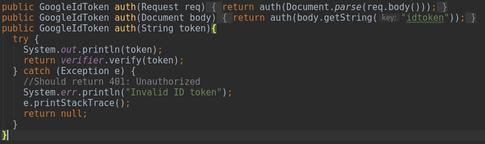
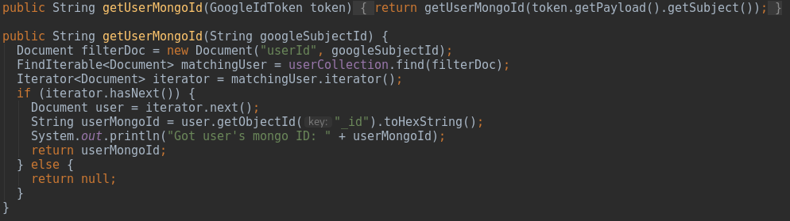
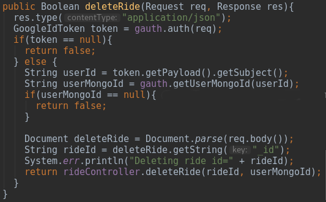
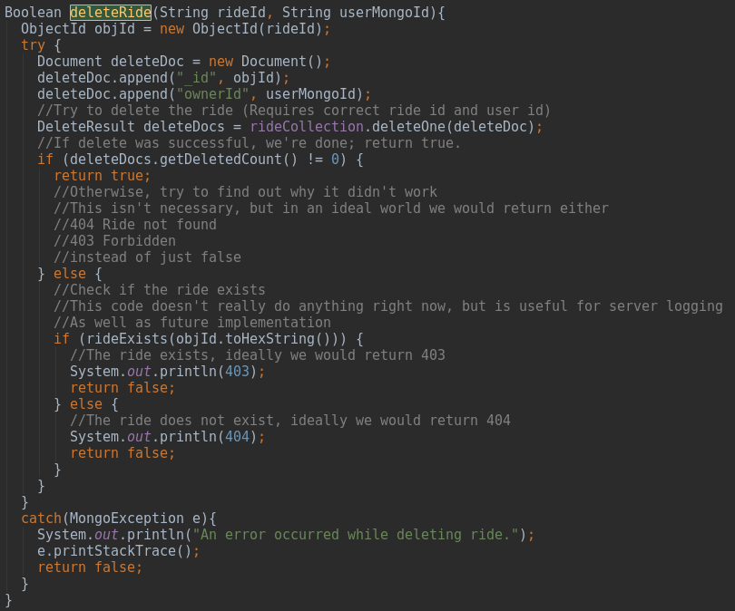

# Secruing API Endpoints

## The Problem

One source of security vulnerabilities in this project was the ability to send requests to the api without authentication.
While the client would restrict activities that a user should not be able to do, such as not displaying the "delete ride"
button for other users' rides. However, an intelligent, but malicious user could call directly to those api endpoints, allowing
them to delete other users' rides. 

__ Include image example of exploit. ___

This is an example of the exploit using Postman, a program designed to make http requests easily. Other methods of doing this
include Insomnia, another graphical application, and curl or similar command line interfaces. Do yourself a favor and use a graphical one.

As you can see, anyone can make a post request to this endpoint and delete any ride that they know the id for. Because these ids
can be easily found, such as in the html of our page, this is not good. As a general rule, you should not trust anything coming
from the client without ensuring you know who is sending the request.

To fix this, we will need to ensure two things

1. The user is logged in (has a valid token)

2. The user is authorized to perform this action

## The Solution

First, we will address the issue with knowing that the user is logged in. This is done through communications with Google.
We do this in the GoogleAuth.java class. Because we will be doing this in many different requests, it was a good idea to
move the code into its own class where it can be reused, rather than copied and pasted in each method. This makes the code more
maintainable, as any changes that have to be made can be made in only one place rather than everywhere.

On to the code!

First, you will have had to implement Google's authentication on both your client and server. The documentation for how to do that
can be found ___ here ___.

Once you've implemented Google authentication in your GoogleAuth class, you can use the same method to get a user's profile before
handling other API requests from them. 

The same auth method used to authenticate logged in users can be called to turn their id token strings into GoogleIdToken objects.
This is important as the object contains all of the information that we need, and the process of turning the string into a GoogleIdToken
only succeeds if the request contains a truly logged in user.

In some cases, it will be enough to know the user is logged in, and your authentication is complete, such as when you're adding a new ride to the database.
However, when editing or deleting rides, you will need to know that the user not only exists, but owns the ride they are trying to change. To do this, we have the 
getUserMongoId Method in our GoogleAuth class. This allows us to turn the userId in the GoogleIdToken object into a mongo user id to make that comparison. 

You can see this whole process through our delete ride endpoint.

When the request comes to the api/rides/remove endpoint, we expect a body containing an idtoken (string) and a rideId to be deleted (String).
We start by passing the request to the deleteRide method in our rideRequestHandler. There it first confirms the request contains a valid idtoken by verifying it through
the aforementioned auth method in our GoogleAuth object, named gauth. if that token is valid, we then get the mongo userId associated with the user's idtoken though gauth.getUserMongoId(userId).
We then pass these two things (the rideId and the user's MongoId) to the rideController.

The ride controller tries to find a ride with both the provided id and owner. If it does this, it deletes it, and returns a successful message (200) to the client.
If it doesn't do this, it could have failed due to one of two reasons.

First, the ride could not exist. In this case, we would like the server to return a 404 error as the ride was not found.

Otherwise, the ride is not owned by the user submitting the request. In this case, we would like to return a 403 error, as the user is forbidden from deleting this ride.

Our code does not do this, and instead returns a generic 500 error, but we have implemented the functionality of determining what error should be returned. It just console logs it.

Additionally, if the user's idtoken is invalid, the server should return a 401, unauthorized. This also doesn't happen, as status codes was out of scope for our iteration.

__ Link to  google's documentation somewhere __

