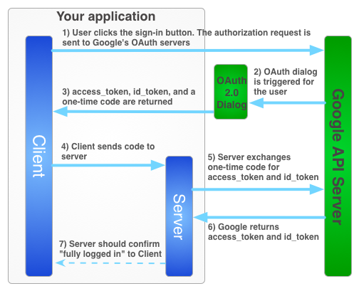
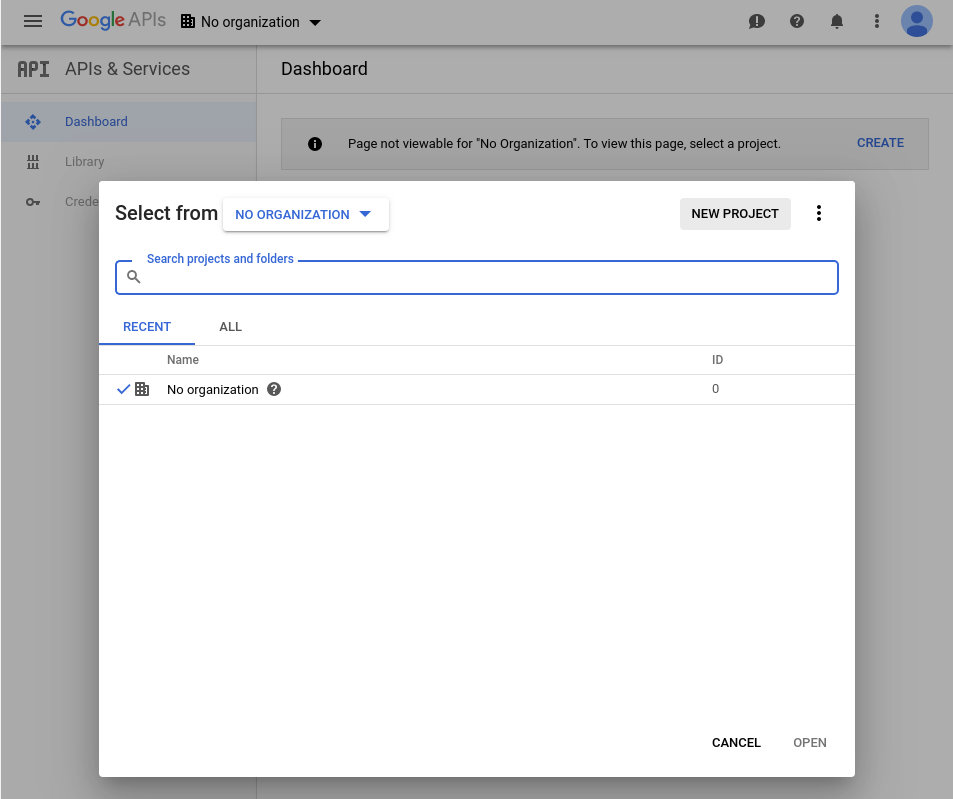
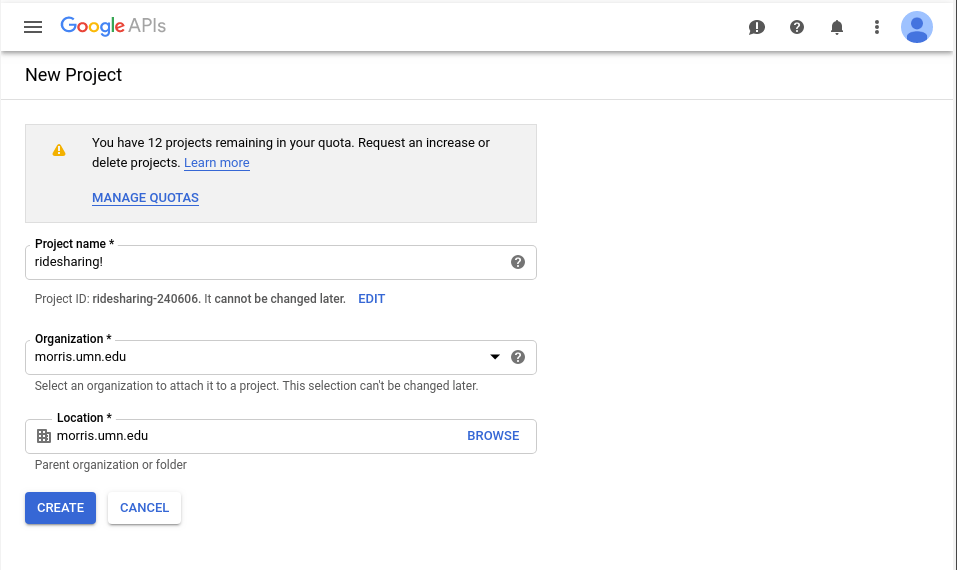
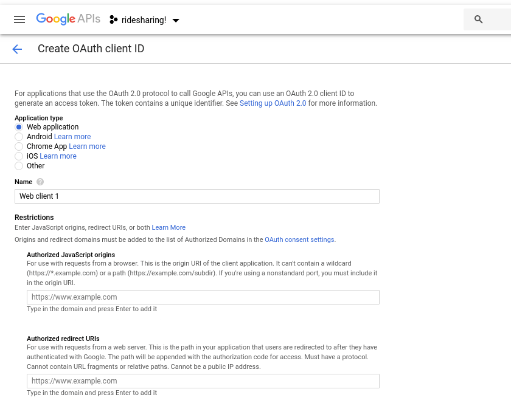

##Before we begin


The above diagram gives us a rough outline of the process.
Both the client and the server have to talk to Google's servers.
The client
initially does this when the user logs in through Google's OAuth Dialog. That returns an id token, which we can pass to our server.
Our server, not trusting the client on it's own, will check to make sure the idtoken is valid before processing any protected requests.

Because both of these steps are needed, the later documentation will be broken up into client and server parts. 
However, before we do any of that, we have to register our project with Google.
## Setting up with Google
Google likes to change stuff, so there's a chance that things will look different when you're trying to do this.
Just in case, here's a [link](https://developers.google.com/identity/protocols/OAuth2?hl=en_US) to Google's official documentation

Make an account on the Google Developer Console.
https://console.developers.google.com/



At this screen, create a new project.



Name it whatever you would like.



Then, under credentials, create an OAuth client ID. You will need to specifically allow the domains that Google should expect requests from.

After this is done, Google will give you a Client Id. This is the code you need for the rest of the steps.


## Getting Gapi (Client)
The core of the client side authentication process is gapi, or Google's API (google api => g api => gapi)
We get gapi from google, specifically by inserting the script into our index.html file. 

    <script src="https://apis.google.com/js/platform.js"></script>

This allows us to use all of the code we will need to authenticate users with Google. We import it into angular through the following line of code.

```{typescript}
declare let gapi: any;

```
The "declare" key word pulls gapi from the html/css environment, as we set it up there in our index.html.

We then have to initialize an auth instance, done by...

```{typescript}
constructor(private client: HttpClient, public router: Router) {
  this.http = client;
  //Calling loadClient in our constructor insures it will run
  this.loadClient();
}
  
loadClient() {
  gapi.load('auth2', function() {
    gapi.auth2.init({
      //This clientId is taken from your google developer console. Fortunately, it doesn't have to be secret.
      'clientId': "Put something here!"
    });
  });
}
```
We've now initialized our auth2 instance, which is where we will do the majority of our actual authentication.
It contains most of the methods and properties we will need to authenticate our users as well as view their data after login.

Gapi is all set up! Now we can send requests to the server

## Getting Gapi (Server)

Like in the client, we need to import a google api script to our server code. We do this in the server/build.gradle file (note: there are multiple build.gradle files, make sure you put it in the correct one.)

```
dependencies{
  //Some dependencies - Don't delete existing ones.
  compile 'com.google.apis:google-api-services-oauth2:v1-rev139-1.23.0'
}
  
```
And that's it! We'll import the parts of this package we need in each file as we need it in later steps.


## Sending Requests (Client)
      <!-- Sign in button -->
      <button id="signIn" *ngIf="!auth.isSignedIn()" (click)="auth.signIn()">
        <input type="image" [src]="buttonSource1">
      </button>
      <!-- Sign out button -->
      <button mat-raised-button id="signOut" *ngIf="auth.isSignedIn()" (click)="auth.signOut()">Sign out</button>
This html code shows a sign in or sign out button and connects it to our authService. The service then handles the logging in.

```{typescript}
signIn() {
  let authInstance = gapi.auth2.getAuthInstance();
  authInstance.signIn()
    .then((data) => {
      let idtoken = data.getAuthResponse().id_token;
      const httpOptions = {
        headers: new HttpHeaders({
          'Content-Type': 'application/json'
        }),
        responseType: 'text' as 'json'
    };

    this.http.post<string>(environment.API_URL + 'login', {idtoken: idtoken}, httpOptions)
      .subscribe((data) => {
      });
    this.signedInFlag = true;
  });
}

signOut() {
  console.log("Signing out");
  let authInstance = gapi.auth2.getAuthInstance();
  authInstance.signOut();
  this.signedInFlag = false;
}
```

As you can see, gapi handles the majority of the process, as a simple call to authInstance.signIn() handles creating a popup,
authenticating with google, and returning the idtoken. 

After we get the response back, we will then send a request to the server.

## Handling Requests (Server)

We create a GoogleAuth class to handle all of our authentication code. This is because we will have a lot of different endpoints that
will call to these methods, and we want to avoid repeated code.

```{java}
private static final GoogleIdTokenVerifier verifier = new GoogleIdTokenVerifier.Builder(transport, JacksonFactory.getDefaultInstance())
    // Specify the CLIENT_ID of the app that accesses the backend:
    .setAudience(Collections.singletonList(CLIENT_ID))
    // Or, if multiple clients access the backend:
    //.setAudience(Arrays.asList(CLIENT_ID_1, CLIENT_ID_2, CLIENT_ID_3))
    .build();
```
The above code builds a verifier which we will use in later code to send the token to google for authentication.

```{java}
public GoogleIdToken auth(String token){
    try {
      System.out.println(token);
      return verifier.verify(token);
    } catch (Exception e) {
      //Should return 401: Unauthorized
      System.err.println("Invalid ID token");
      e.printStackTrace();
      return null;
    }
  }
```

This code takes a token and passes it to the verifier. If the token is valid, it returns a GoogleIdToken object. This object contains
all of the user's information from Google, including their subject, which as an identifying id, as well as things like their name and photo.

```{java}
  public String getName(String token){
    return (String) auth(token).getPayload().get("name");
  }

  public String getUserId(String token){
    return (String) auth(token).getPayload().getSubject();
  }
  public String getPicture(String token){
    return (String) auth(token).getPayload().get("picture");
  }
```

These are three examples of how we get properties from the GoogleIdToken.


To actually secure your endpoints and ensure that only the correct users can make requests, read the api lockdown documentation, also in this folder.
